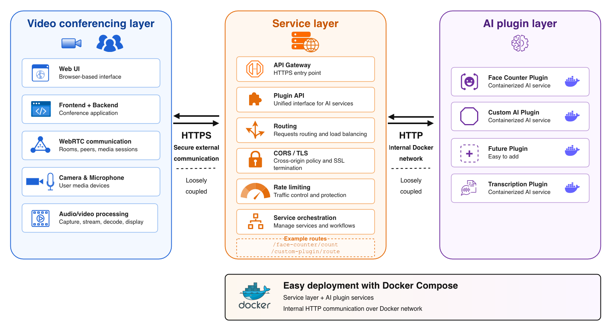
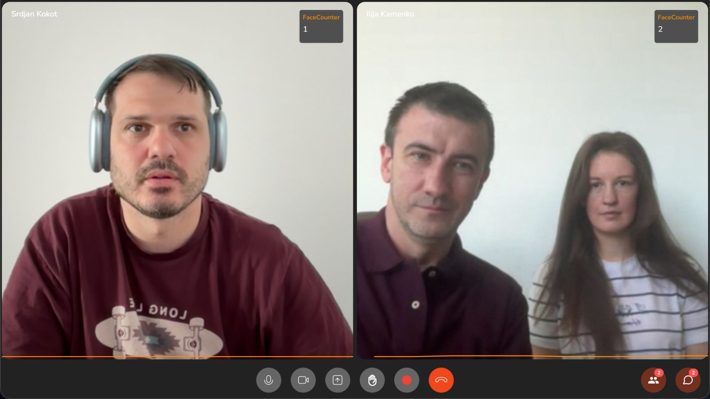

# Intelligent Video Conferencing Toolkit

**Intelligent Video Conferencing Toolkit (IVCT)** is a modular video conferencing platform with support for WebRTC communication, a backend service, and an AI module for video frame analysis.

The project is divided into three main parts:

- **Frontend** — a Flutter Web application for the user interface and video conferencing.
- **Backend** — the server-side part of the application.
- **AI** — a Dockerized AI service for analyzing images and video frames.

---

## System Architecture

The diagram below shows the overall system architecture and the relationship between the main application components.



---

## Application Demo

The image below shows an example of the application in use.



---

## Modules

Detailed documentation for each module is available in its own README file:

| Module | Description | Documentation |
|---|---|---|
| Frontend | Flutter Web application for video conferencing, communication with the backend, Janus WebRTC Gateway, and AI service. | [frontend/README.md](frontend/README.md) |
| Backend | Server-side part of the system. | [backend/README.md](backend/README.md) |
| AI | Dockerized AI service for image and video frame analysis. | [AI/README.md](AI/README.md) |

---

## Technologies

The project uses the following main technologies:

- **Flutter / Dart** for the frontend application.
- **Janus WebRTC Gateway** for WebRTC communication.
- **STUN/TURN server**, such as Coturn, for WebRTC connectivity.
- **Python / Flask** for the AI service.
- **Docker / Docker Compose** for running the AI module.
- **Nginx** as the HTTPS API gateway for the AI service.

---

## System Workflow

1. The user accesses the application through the Flutter Web frontend.
2. The frontend communicates with the backend service.
3. Video communication is established through the Janus WebRTC Gateway.
4. The STUN/TURN server enables WebRTC connections under different network conditions.
5. The frontend or backend sends video frames to the AI module.
6. The AI module returns the analysis result, such as the number of detected faces per participant.

---

## Recommended Startup Order

The recommended startup order is:

1. Start the **STUN/TURN server**.
2. Start the **Janus WebRTC Gateway**.
3. Start the **backend** service.
4. Start the **AI** module, if used.
5. Start the **frontend** application.

---

## Running the Project

For detailed setup and run instructions, see the module-specific documentation:

- [Frontend documentation](frontend/README.md)
- [Backend documentation](backend/README.md)
- [AI documentation](AI/README.md)

A typical local development setup assumes that the backend, Janus WebRTC Gateway, and STUN/TURN server are running before starting the frontend application.

---

## AI Module

The AI module receives images or video frames and returns analysis results. The current implementation supports face counting.

Example AI service response:

```json
{
  "results": [
    {
      "call_id": 158,
      "participant_id": "2",
      "score": 1
    }
  ]
}